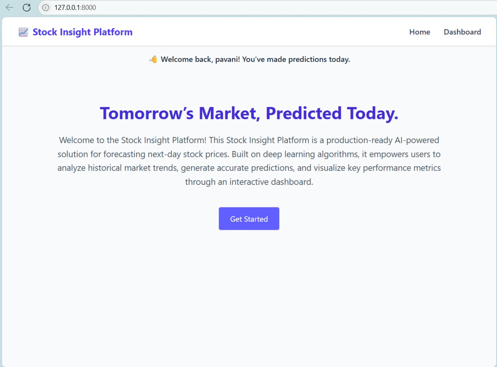
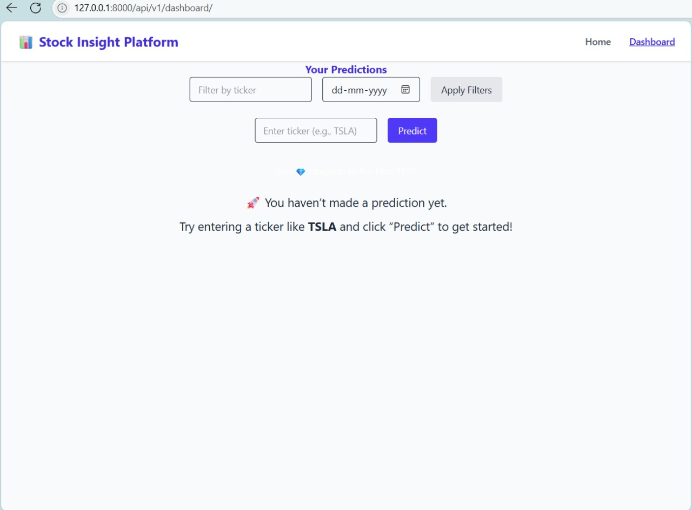
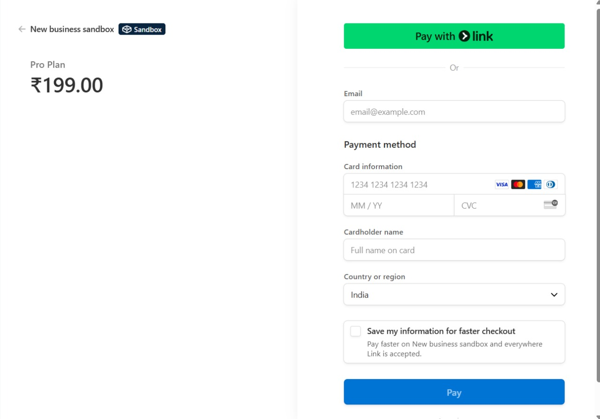

# 📈 Stock Insight Platform

**Micro-SaaS project for internship challenge** — a full-stack platform that uses LSTM to predict next-day stock prices via REST API, web dashboard, and Telegram bot. Stripe integration unlocks Pro features. Fully Dockerized.

---

## 🔧 Tech Stack

| Layer        | Tools                         |
|--------------|-------------------------------|
| Backend      | Django REST Framework         |
| Frontend     | Django Templates + Tailwind CSS |
| ML Model     | Keras (LSTM) + yfinance       |
| Auth         | JWT (SimpleJWT)               |
| Payments     | Stripe + Webhooks             |
| Bot          | python-telegram-bot v22.1     |
| Deployment   | Docker + Gunicorn             |

---

## 🚀 Features

### 🌐 Authentication

- `POST /api/v1/register/` – Register user
- `POST /api/v1/token/` – Obtain JWT token
- JWT auth for all protected endpoints

### 📊 Prediction API

- `POST /api/v1/predict/` – Predict stock price
- `GET /api/v1/predictions/` – List user predictions
- Predictions stored in SQLite with charts + metrics

### 🧠 ML Pipeline

- Loads `stock_prediction_model.keras` at runtime
- Fetches OHLCV data via yfinance (10 years)
- Uses MinMaxScaler from provided config
- Generates 2 charts:
  1. Closing-price history
  2. Predicted vs Actual (test split)
- Django management commands:
  ```bash
  python manage.py predict --ticker TSLA
  python manage.py predict --all


🎨 Frontend Dashboard
Tailwind CSS, no React/Vue/Bootstrap

AJAX-based ticker form

Displays price + charts

Table of past predictions (server-rendered)

Pro-only elements gated by:



🛡️ Health Check
GET /healthz/ returns { "status": "ok" } with HTTP 200

Used by CI/CD pipeline for container validation

🤖 Telegram Bot
Command: python manage.py telegrambot

Long-polling mode only (no webhooks)

Commands:

/start → link Telegram chat_id

/predict TSLA → returns next-day price + charts

/latest → user's latest prediction

/help → brief command guide

Rate limit: max 10 predictions/min

Stores chat_id in TelegramUser model

💰 Stripe Subscription Logic
Tiers
Tier	Web Features	Telegram Features
Free	5 predictions/day, banner	5 /predict calls/day
Pro	Unlimited, priority queue	Unlimited /predict + /stats

Stripe Integration
Stripe Checkout (test mode ₹199)

Webhook endpoint:

POST /api/v1/webhooks/stripe/
Toggles UserProfile.is_pro = True

CLI used for local testing:

bash
stripe listen --forward-to http://localhost:

Quota Middleware
Blocks Free users after 5 predictions/day

Returns HTTP 429 if quota exceeded

🐳 Docker Setup
Uses Gunicorn in production:

bash
gunicorn stock_prediction_main.wsgi:application --bind 0.0.0.0:8000 --workers 3
Collects static assets during image build

Health check in docker-compose.yml

Example command:

bash
docker compose up --build

🌱 Environment Configuration
All secrets via .env file:

# Django core
DEBUG=False
SECRET_KEY=your-secret-key
DJANGO_ALLOWED_HOSTS=localhost,127.0.0.1
CSRF_TRUSTED_ORIGINS=http://localhost

# DB
DATABASE_URL=sqlite:///db.sqlite3

# ML
MODEL_PATH=stock_prediction_model.keras

# Stripe
STRIPE_PUBLIC_KEY=pk_test_xxx
STRIPE_SECRET_KEY=sk_test_xxx

# JWT
JWT_ACCESS_LIFETIME=15
JWT_REFRESH_LIFETIME=1440

# Telegram
BOT_TOKEN=telegram-bot-token

⚠️ Do not commit .env to GitHub. Use .env.example.

📂 Folder Structure

stock-insight-platform/
├── api/
│   ├── urls.py
│   ├── views.py
│   ├── models.py
│   └── management/
│       └── commands/
│           └── telegrambot.py
├── templates/
│   └── dashboard.html
├── static/
│   └── tailwind.css
├── Dockerfile
├── docker-compose.yml
└── stock_prediction_model.keras



stripe listen --forward-to http://localhost:8000/api/v1/webhooks/stripe/


## 🖼️ Screenshots

### 🏠 Homepage


### 📊 Dashboard


### 💳 Stripe Checkout



✨ Suggestions to Maximize Impact
✅ Label it more boldly:

## ✅ Final Submission Checklist
✅ Mention CI readiness briefly:

[x] CI health check passes with HTTP 200 on /healthz
✅ Link your real GitHub profile: Replace 🔗 GitHub Profile (example link) with:
🔗 [GitHub Profile](https://github.com/pavanipitti)

[x] 🎯 Stripe webhook toggles `is_pro = True`
[x] 🐳 Docker uses Gunicorn (no `runserver`)
[x] 🛡️ /healthz endpoint returns HTTP 200
[x] 📈 Dashboard loads Tailwind styles correctly
[x] 🧠 LSTM model runs via `python manage.py predict`
[x] 🤖 Telegram bot handles `/predict` and rate-limit
[x] 📦 Static assets collected
